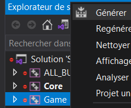
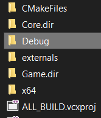
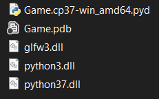

# **Scripting System**

## **Summary**

- [Description](##Description)
- [Configuration](##Configuration)
- [Third-party programs and libraries](##Third-party%20programs%20and%20libraries)
- [References](##References)

 

## **Description**

The goal of the project is to :
- familiarize ourselves with the c++/python binding and thus be able to imagine all sorts of applications
- learn about a dynamic language
- learn about integration in a static environment

 

## **Configuration**

The build can be found under the GOLD release.
To launch the game just execute "launcher.bat" in the folder "project".

The program runs in Debug platform x64. 

 Program                | Version      
 -------                | -------
 Visual Studio 2019     | 16 (minimum)  
 Python                 | 3.7.8  
 CMake                  | 3.21.3  
 pybind11               | 2.8.0     

If you want to modify some player variables open the python file Player.py in source/Game/scripts.
You can use the hot reload by pressing the H key (you need to press Alt+Tab to exit the game window).

GITLAB
---
When you clone the project unzip Other.zip.  
Then execute "generate_vs2019.bat" in the folder project to create the .sln solution.  
Open the solution and generate the project Game:  

It will create a Debug folder:  

You need to put the DLLs inside, they can be found in the folder project/dll:  

You can now run the game by pressing F5 in Visual Studio or using "launcher.bat".

 

## **Third-party programs and libraries**

pybind11
---
https://github.com/pybind/pybind11.git

GLFW
---
https://www.glfw.org/

Glad
---
https://glad.dav1d.de/

 

## **References**

Python
---
https://docs.python.org/3.7/

pybind11
---
- https://www.youtube.com/playlist?list=PLb9uFnQyeGTcKIHNUNUUuLbRhumAZd-fy
- https://github.com/pybind/pybind11
- https://www.youtube.com/watch?v=_5T70cAXDJ0
